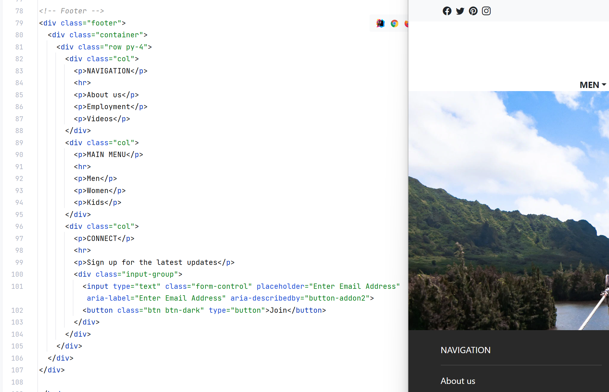

Being someone completely new to HTML, CSS, and UI frameworks, it had been a lot to consume. I also think that if you asked my opinion on whether I prefer straight HTML and CSS over using a UI framework, the fact that I had learned a bit of both in quick succession highly influences my answer.

## The Pros

The particular framework I worked with was Bootstrap 5; to me, it doesn't work against what I've learned about HTML and CSS up to that point. It feels as though it has allowed me to do more with a web page. As someone with a graphic design and layout design background, I liked how Bootstrap 5 gave me a little more to play with without me having to do extra work. This includes having easy to use visual components such as buttons, icons, and cards and having classes that organize and space out the elements on the page such as containers, navbars, and padding and margins that don't have to be in a separate style block. I also feel that it made my code much neater and organized than my starting HTML projects.

## The Cons

I feel as though I worked smoothly with it so long as I knew what all the classes do. But that also became an issue. I basically forgot what basic HTML and CSS were capable of. Working alone, I had issues with changing the text color, not remembering the syntax or where to place the code, only to smack myself in the head looking it up and being reminded that I knew how to do it. I thought I had gained some freedom, when the reality was I had trapped myself to only what Bootstrap is capable of at default without the necessary knowledge of HTML and CSS, necessitating that I learn that material all over again.

## Worth It?

At the end of the day, I think me not being familiar with HTML is a personal skill issue I have, and I don't consider learning to use a framework a waste of time. It reinforced the importance of knowing HTML and CSS while also giving me a boost that allowed me to make nice pages which was a very rewarding experience. I prefer a framework for that boost, but HTML is important to know!
